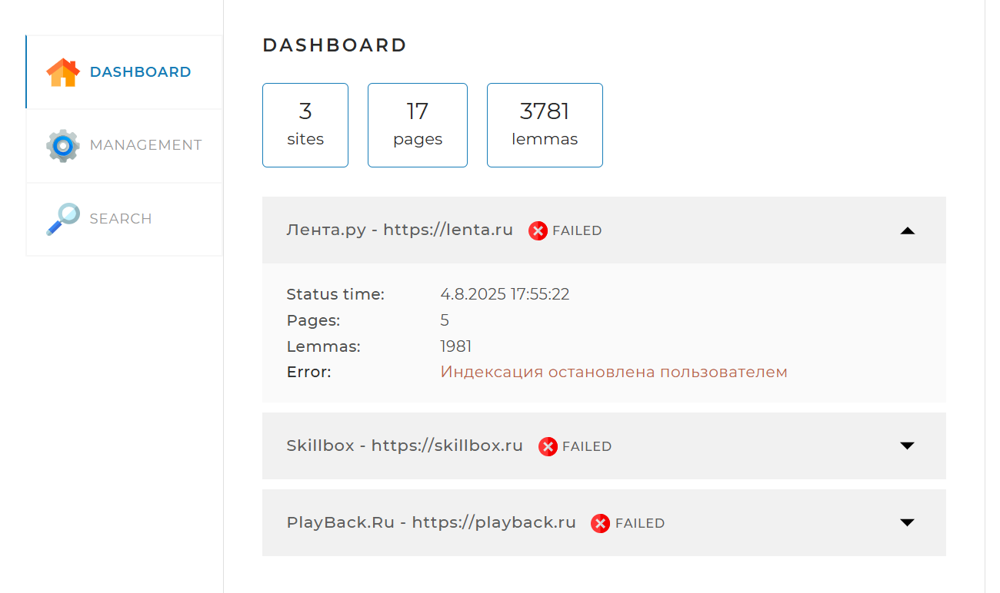
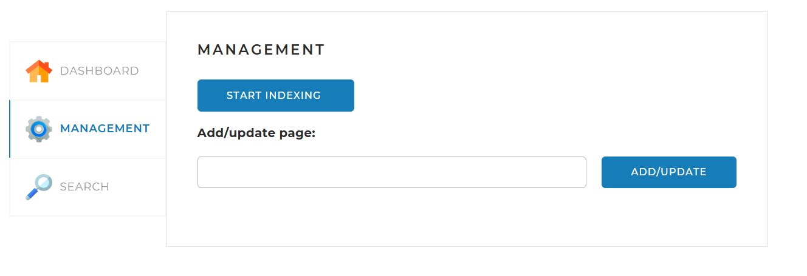
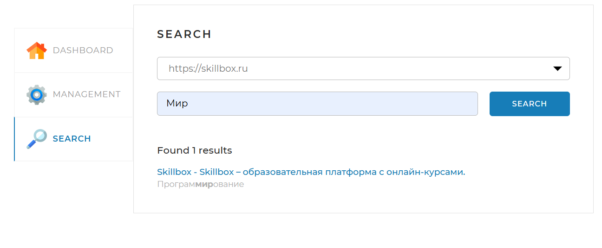

# 📚 SearchEngine

## 📌 Описание проекта

**SearchEngine** — это веб-приложение для индексирования и поиска информации с использованием морфологического анализа текста.  
Приложение предназначено для сбора, хранения и обработки HTML-страниц и предоставляет удобный веб-интерфейс для управления индексами и тестирования поиска.

---

## 🖥️ Веб-интерфейс

Веб-интерфейс (frontend) реализован на базе **Thymeleaf** и состоит из одной веб-страницы с тремя вкладками:

- **📊 Dashboard**

    - Открывается по умолчанию.
    - Отображает общую статистику по всем индексируемым сайтам.
    - Отображает детальную статистику и статус для каждого отдельного сайта.
    - Данные загружаются по API-запросу: `GET /api/statistics`.

- **⚙️ Management**

    - Содержит инструменты управления поисковым движком.
    - Позволяет запускать и останавливать полную индексацию (переиндексацию) по запросу `GET /api/startIndexing` и `GET /api/stopIndexing` соответственно.
    - Позволяет добавить или обновить отдельную страницу по ссылке.

- **🔍 Search**

    - Предназначена для тестирования поискового движка.
    - Содержит поле поиска и выпадающий список для выбора сайта.
    - По нажатию кнопки «Найти» выводятся результаты поиска.
    - Результаты загружаются по API-запросу: `GET /api/search`.

Вся информация на вкладки подгружается динамически через запросы к REST API приложения.  
При взаимодействии с кнопками также отправляются соответствующие запросы на сервер.

---

## ⚙️ Стек технологий

### ☕ Язык и сборка
- **Java 21**
- **Maven**

---

### 🚀 Backend-фреймворк
- **Spring Boot 3.4.5**
    - `spring-boot-starter-web` — REST API и веб-контроллеры
    - `spring-boot-starter-thymeleaf` — серверный рендеринг HTML-шаблонов
    - `spring-boot-starter-data-jpa` — ORM и взаимодействие с базой данных

---

### 🗄️ База данных
- **MySQL Connector/J 8.0.33** — драйвер подключения к MySQL

---

### ⚙️ Миграции БД
- **Liquibase** — контроль версий и автоматические миграции схемы базы данных

---

### 🔍 Парсинг и морфология
- **Jsoup** — парсинг и извлечение данных из HTML
- **Apache Lucene Morphology 1.5**
    - `morph` — морфологический анализатор
    - `morphology` — лексический анализ текста
    - `dictionary-reader` — работа с морфологическими словарями
    - `english` и `russian` — поддержка английского и русского языков

---

### 🧰 Утилиты
- **Apache Commons Lang 3.18.0** — расширенные утилиты для работы со строками и коллекциями
- **Lombok** — автоматическая генерация шаблонного кода (геттеры, сеттеры и пр.)

---

### ✅ Тестирование
- **JUnit Jupiter (JUnit 5)** — юнит-тестирование
- **Mockito Core** — мокирование зависимостей
- **Spring Boot Starter Test** — интеграционное тестирование компонентов Spring

---

## 🚀 Инструкция по локальному запуску

### ✅ 1. Клонируйте репозиторий

```bash
  git clone https://github.com/kshmailov/SearchEngine.git
```

---

### ✅ 2. Установите и настройте MySQL

1. Установите MySQL и запустите сервер.
2. Создайте базу данных и пользователя:
   ```sql
   CREATE DATABASE search_engine CHARACTER SET utf8mb4 COLLATE utf8mb4_unicode_ci;
   CREATE USER 'root'@'localhost' IDENTIFIED BY 'lutin199106';
   GRANT ALL PRIVILEGES ON search_engine.* TO 'root'@'localhost';
   FLUSH PRIVILEGES;
   ```
    Примечание: Нового пользователя создавать не обязательно! Если есть существующий пользователь, то можно его указать в команде GRANT ALL PRIVILEGES. Соответствующий пользватель должен быть указан в параметрах настроек подключения к БД. Также команду CREATE USER в этом случае нужно будет пропустить.
  
    Дополнительно можно создать базу данных для тестов.
   ```sql
   CREATE DATABASE testdb CHARACTER SET utf8mb4 COLLATE utf8mb4_unicode_ci;
   CREATE USER 'user'@'localhost' IDENTIFIED BY 'password';
   GRANT ALL PRIVILEGES ON testdb.* TO 'user'@'localhost';
   FLUSH PRIVILEGES;
   ```
   Примечание: По аналогии с рабочей БД. Можно использовать существующую БД.
---

### ✅ 3. Настройте параметры подключения

Откройте `src/main/resources/application.yaml` и укажите свои настройки:

```properties
spring:
    datasource:
        username: root
        password: lutin199106
        url: jdbc:mysql://localhost:3306/search_engine?useSSL=false&requireSSL=false&allowPublicKeyRetrieval=true
        driver-class-name: com.mysql.cj.jdbc.Driver
    jpa:
        properties:
            dialect: org.hibernate.dialect.MySQL8Dialect
        hibernate:
            show-sql: true
            hibernate.ddl-auto: none
```

Примечание: Параметры настроек подключения должны соответствовать настроенным в MySQL ранее.  
Для тестовой БД откройте `src/test/resources/application-test.yaml` и укажите свои настройки:
```properties
spring:
    datasource:
        driver-class-name: com.mysql.cj.jdbc.Driver
        url: jdbc:mysql://localhost:3307/testdb?useSSL=false&allowPublicKeyRetrieval=true&serverTimezone=UTC
        username: user
        password: password
    jpa:
        properties:
            hibernate:
                dialect: org.hibernate.dialect.MySQL8Dialect
        hibernate:
            show-sql: true
            hibernate.ddl-auto: none
```

Примечание: Параметры настроек подключения должны соответствовать настроенным в MySQL ранее.

---

### ✅ 4. Соберите и запустите проект

```bash
  mvn clean install
  mvn spring-boot:run
```

Приложение будет доступно по адресу: [http://localhost:8080](http://localhost:8080)  
В случае если тестовая база данных не была создана ранее и настроено для нее подключение, то команда `mvn clean install` заменяется на `mvn clean install -DskipTests`.

---

### ✅ 5. Проверьте работу API

- Dashboard: \`GET http://localhost:8080/api/statistics\`
- Search: \`GET http://localhost:8080/api/search\`
- Управление: через интерфейс или соответствующие эндпоинты.


---

## ℹ️ Примечания

- Требуются **Java 21** и **Maven**.
- Убедитесь, что порт **8080** свободен.
- Liquibase автоматически применит миграции при первом запуске.

---

## 👨‍💻 Авторы и лицензия

> 📄 Этот проект создан в учебных целях.
